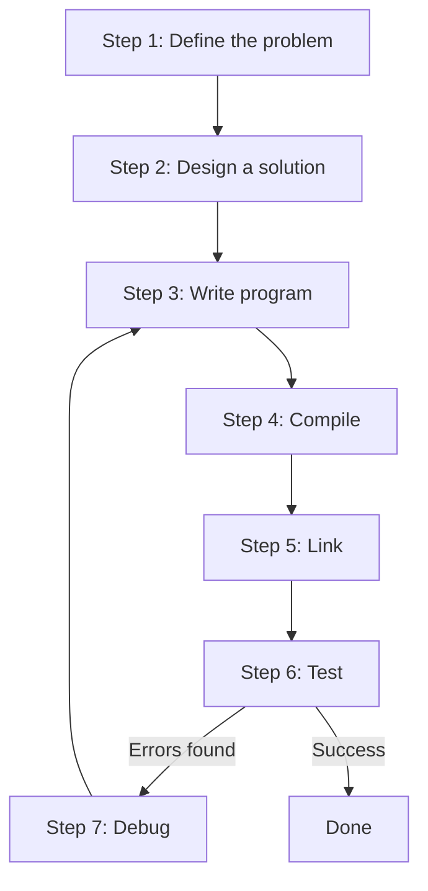

# Page 12

## C++ Learning Notes

> This is a document containing resources and notes from learncpp.com. It shall follow the course thoroughly.

### Things to know & understand before learning programming

* A computer program is a sequence of instructions that directs a computer to perform specific actions in a particular order.
* When a computer executes the actions described by these instructions, we say it is "running" or "executing" the program.
* A computer will not execute a program on its own — it must be explicitly told to do so.
* Programs are executed on the computer’s hardware, which consists of the physical components that make up the system.
  * The CPU (Central Processing Unit) is responsible for executing programs.
  * Memory is where programs are loaded before execution.
  * Interactive devices (monitor, touchscreen, mouse, keyboard, etc.) allow a person to interact with the computer.
  * Storage devices (hard drives, SSDs, flash memory, etc.) retain information and installed programs even when the system is turned off.
* Software refers to the programs that run on top of the hardware.
* The term “platform” typically refers to the combination of hardware and software that provides an environment for other software to run (e.g., operating systems, browsers, etc.).
* There are two types of programs — platform dependent and portable.
  * Platform-dependent programs rely on the specific structure or resources of a certain platform.
  * Portable programs can be easily transferred between platforms. The act of modifying a program so that it runs on a different platform is called porting.

***

### Machine Language (Machine Code) — the binary code (language of 0s and 1s)

* Each instruction is composed of binary digits, or ‘bits’.
* The number of bits in a machine instruction varies — some CPUs use fixed-size instructions (e.g., 32 bits), while others (like x86 CPUs) use variable-length instructions.
* Each family of compatible CPUs (e.g., x86, ARM64) has its own machine code, which is not compatible with that of other CPU families.
  * This means machine code written for one CPU family cannot run on a different family!
* A CPU family is formally called an “Instruction Set Architecture (ISA)”.
  * See list: [Comparison of instruction set architectures](https://en.wikipedia.org/wiki/Comparison_of_instruction_set_architectures#Instruction_sets)

***

### Assembly Language — a more human-readable version of machine language

*   Operations are represented by short mnemonics:

    * `mov` — “move”, an operation that copies bits from one location to another.
    * `al` — a specific register name on an x86 CPU (registers are fast memory locations built into the CPU, accessed by name in assembly).
    * Numbers can be written conveniently in decimal (97) or hexadecimal (0x61).

    **Example:**

    ```asm
    mov al, 0x61
    ; copies the hexadecimal number 0x61 into the CPU register ‘al’.
    ```
* CPUs cannot directly execute assembly language, so it must be translated into machine language by a program called an assembler.
* This translation process is straightforward because each assembly instruction typically corresponds to a specific machine instruction.
* Just like each CPU family has its own machine language, each also has its own assembly language, designed to assemble into its specific machine code.
  * This means there are many assembly languages — conceptually similar, but differing in supported instructions, syntax, and naming conventions.

***

### Introduction to Low-Level Languages

* Low-level languages are tailored to the specific instruction set architecture (ISA) they are designed to run on.
* **Downsides of low-level languages:**
  * Programs written in low-level languages are not portable — they are ISA-specific.
  * Writing them requires detailed knowledge of the ISA.
  * They are hard to read and maintain; complex programs are difficult to create because these languages provide only primitive capabilities.

***

### Introduction to High-Level Languages

* High-level languages were developed to overcome the limitations of low-level languages.
* Programs written in high-level languages must be translated into machine language before they can run. This can be done in two ways — compiling or interpreting.
* C++ programs are usually compiled.
  * A compiler is a program that reads source code written in one language and translates it into another (usually lower-level) language.
* Most C++ compilers can also generate assembly code — useful for programmers who want to inspect what machine instructions are generated.
* The machine code output by the compiler can be packaged into an executable file (e.g., .exe), which contains machine instructions and can be distributed to others.
* Running the executable file does not require the compiler to be installed.

**A simple representation of the compiling process:**


* An interpreter is a program that directly executes the source code without compiling it first.
* Interpreters are more flexible but less efficient, since interpretation happens each time the program runs. This also means the interpreter must be installed on every system where the program will be executed.

**Representation of the interpretation process:**


> [A good read on compiler vs interpreter](https://stackoverflow.com/questions/38491212/difference-between-compiled-and-interpreted-languages/38491646#38491646)

* Neither approach has a definitive advantage over the other — if one were clearly superior, the other wouldn’t exist.

#### Advantages of Compilers

1. Compilers can analyze the entire codebase at once, allowing for deeper analysis and optimization, resulting in faster execution than interpreting line-by-line.
2. They can translate high-level concepts (like dynamic dispatch or inheritance) into efficient low-level memory operations, reducing runtime overhead and memory usage.
3. Compiled programs generally run faster since the CPU executes only the program’s instructions without interpreter overhead.

#### Disadvantages of Compilers

1. Some language features (like dynamic typing) are difficult to optimize because their behavior isn’t known until runtime, resulting in less efficient compiled code.
2. Compilation can take time — long startup delays make compilers less ideal for short or frequently loaded programs (e.g., web scripts).

#### Advantages of Interpreters

1. Interpreters can start executing code immediately since they skip the compilation step.
2. They can apply dynamic optimizations during execution based on how the program actually behaves at runtime.

#### Disadvantages of Interpreters

1. Interpreters use more memory because they must retain detailed program information at runtime.
2. Execution is slower since part of the CPU’s work goes into running the interpreter itself.

***

### Things to keep in mind

1. Modern runtimes often combine compilation and interpretation for better performance and this is called Hybrid approach.
2. The Java JVM first interprets bytecode, then JIT-compiles frequently used code into machine code.
3. JVM performs dynamic optimizations like inline caching to boost execution speed.
4. Javascript engines use a similar approach - start with interpretation for fast startup, then compile hot code (frequently used code is called hot code) for efficiency.
5. Languages themselves aren't inherently compiled or interpreted - it depends on their implementation.
6. The futamura projections show that anything that can interpreted can, in theory, also be compiled.

#### Futamura Projections

* (i.) specializing the interpreter with a source program gives a compiled program `[ interpreter + program -> executable ]`
* (ii.) specializing the specializer (partial evaluator) with the interpreter gives a compiler. `[ specializer + interpreter -> compiler ]`
* (iii.) specializing the specializer with itself gives a compiler-generator. `[ specializer + itself -> compiler - compiler ]`

***

### Benefits of High-level Languages

* High level languages provide a high level of abstraction from the underlying architecture.
* High level languages allow programmers to write programs without knowing much about the platform the program will be running on.
* The program becomes more portable. A program that is designed to run on multiple platforms is said to be cross-platform.
* Programs written in High level language are easy to read - write and learn.

**Cross-platform compilation visualization:**

```
       +---------------------------+
       |   High-level language     |
       |          code             |
       +---------------------------+
              /          |          \
             /           |           \
            v            v            v
+----------------+  +----------------+  +----------------+
| Compiler for   |  | Compiler for   |  | Compiler for   |
| x86 hardware   |  | PowerPC hw     |  | MIPS hardware  |
+----------------+  +----------------+  +----------------+
      |                   |                   |
      v                   v                   v
+----------------+   +----------------+   +----------------+
|  x86 executable|   | PowerPC exec.  |   | MIPS executable|
+----------------+   +----------------+   +----------------+
```

* **Platform-specific features** - using OS-specific capabilities (like windows APIs) makes your program less portable.
* **Third-party library limitations** - some libraries work only on specific platforms, restricting where your code can run.
* **Compiler-specific extensions** - using features unique to one compiler can prevent code from compiling on others.
* **Implementation-defined behaviour** - some c++ behaviours vary by compiler, affecting consistency across platforms.
* **Portability importance** - If your app targets only one platform, portability may not seem important - but cross-platform support increase reach.
* **Future-proofing** - starting with portability in mind saves times later if you decide to expand to other systems (example - from PC to Mac or Consoles).

***

### INTRODUCTION TO C/C++

* The C language was developed in 1972 by Dennis Ritchie at Bell Telephone labs, Ritchie's primary goal were to produce a minimalistic language that was easy to compile, allowed efficient access to memory, produce efficient code and was self-contained, by 1973 it ended up being so efficient that most of UNIX was rewritten in C. The C language has excellent portability.
* In 1983 the American National Standards Institute (ANSI) formed a committee to establish a formal standard for C. In 1989 they released the first standard for C, which was called C89 or more commonly ANSI C and in 1990 ISO adopted ANSI C with a few modifications and it was came to be called as C90 and in 1999 ISO again relased a revised version of the standards and it was called C99. C99 adopted many features which had already made their way into compilers as extensions, or had been implemented in C++.
* C++ was developed by Bjarne Stroustrup at bell labs as an extension to C, starting in 1979. The most notable feature of C++ is that it supports object-oriented programming.
* C++ was standardized in 1988 by the ISO committee. The updates are usually made in a span of 3 years. The official name for C++ 20 was ISO/IEC 14882:2020.

#### C & C++ philosophy

* The underlying philosophy of C/C++ is -> "Trust the programmer". C++ is designed to allow the programmer a high degree of freedom to do what they want. This is one of the primary reasons why knowing what you shouldn’t do in C/C++ is almost as important as knowing what you should do.
* C++ excels in situations where high performance and precise control over memory and other resources is needed, C++ also has a large number of high-quality 3rd party libraries available, which can shorten development times significantly.

***

### Introduction to C++ development

#### Approach to follow in general

1. **Define the problem to solve**
2. **Design a solution**
3. **Write a program that implements the solution**
4. **Compile the program**
5. **Link object files**
6. **Test program**
7. **Debug** (if needed, back to step 3 or 4)

**Development Flow:**



#### Step 1: Define the problem that you would like to solve

This is the “what” step, where you figure out what problem you are intending to solve. Coming up with the initial idea for what you would like to program can be the easiest step, or the hardest. But conceptually, it is the simplest. All you need is an idea that can be well defined, and you’re ready for the next step.

#### Step 2: Determine how you are going to solve the problem

This is the “how” step, where you determine how you are going to solve the problem you came up with in step 1. It is also the step that is most neglected in software development. The crux of the issue is that there are many ways to solve a problem -- however, some of these solutions are good and some of them are bad. Too often, a programmer will get an idea, sit down, and immediately start coding a solution. This often generates a solution that falls into the bad category.

Typically, **good solutions have the following characteristics:**

* They are **straightforward** (not overly complicated or confusing).
* They are **well documented** (especially around any assumptions being made or limitations).
* They are **built modularly**, so parts can be reused or changed later without impacting other parts of the program.
* They can **recover gracefully** or give useful error messages when something unexpected happens.

When you sit down and start coding right away, you’re typically thinking “I want to do ”, so you implement the solution that gets you there the fastest. This can lead to programs that are fragile, hard to change or extend later, or have lots of bugs. A bug is any kind of programming error that prevents the program from operating correctly.

#### Step 3: Write the program

use a code editor, it makes it easy to read and manage the code.

**Step 4: Compiling your source code**

The C++ compiler sequentially goes through each source code (.cpp) file in your program and does two important tasks:

First, the compiler checks your C++ code to make sure it follows the rules of the C++ language. If it does not, the compiler will give you an error (and the corresponding line number) to help pinpoint what needs fixing. The compilation process will also be aborted until the error is fixed.

Second, the compiler translates your C++ code into machine language instructions. These instructions are stored in an intermediate file called an **object file**. The object file also contains other data that is required or useful in subsequent steps (including data needed by the linker in step 5, and for debugging in step 7).

Object files are typically named name.o or name.obj, where name is the same name as the .cpp file it was produced from.

eg. --> source file: main.cpp --> object file: main.o

**Step 5: Linking object files and libraries and creating the desired output file**

After the compiler has successfully finished, another program called the **linker** kicks in. The linker’s job is to combine all of the object files and produce the desired output file (such as an executable file that you can run). This process is called linking. If any step in the linking process fails, the linker will generate an error message describing the issue and then abort.

**First, the linker reads in each of the object files generated by the compiler and makes sure they are valid.**

**Second, the linker ensures all cross-file dependencies are resolved properly.** For example, if you define something in one .cpp file, and then use it in a different .cpp file, the linker connects the two together. If the linker is unable to connect a reference to something with its definition, you’ll get a linker error, and the linking process will abort.

**Third, the linker typically links in one or more library files, which are collections of precompiled code that have been “packaged up” for reuse in other programs.**

**Finally, the linker outputs the desired output file.** Typically this will be an executable file that can be launched (but it could be a library file if that’s how you’ve set up your project).
