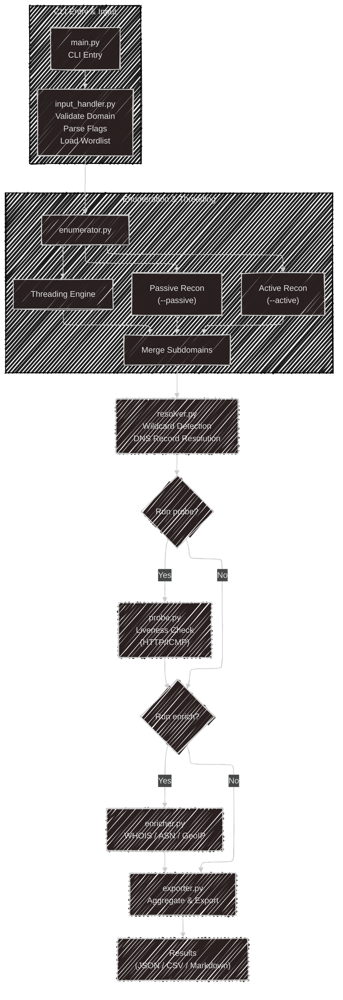

# DNS Enumeration Framework (Day-1)

> This is a **DNS Enumeration and Reconnaissance Framework** built with Python. It uncovers subdomains and DNS records using both **active brute-force techniques** and **passive API-based reconnaissance**—designed to help security analysts, penetration testers, and ethical hackers detect hidden assets, misconfigurations, and infrastructure exposures.

**At its heart, it helps answer:**

> “What DNS records and subdomains exist that attackers could exploit—and how alive or misconfigured are they?”

> <mark style="color:yellow;">**What I Intend to Learn from This Tool ?**</mark>
>
> Right now, I am not sure, _**I have just started working over it on a whim**_, let's see where and how things go.

***

#### **What Language, Tools & Techniques Does It Use?**

| Type              | Stack / Tool                      | Purpose                             |
| ----------------- | --------------------------------- | ----------------------------------- |
| 🐍 Language       | Python 3.x                        | Main programming language           |
| 🔧 Core Libraries | `dnspython`, `requests`           | DNS querying + API access           |
| ⚙️ Modules        | `argparse`, `threading`           | CLI flags + concurrency             |
| 🌐 APIs           | SecurityTrails, Shodan (optional) | Passive OSINT data                  |
| 📁 Output         | JSON / CSV / Markdown             | Saving and sharing results          |
| 🖥️ Optional GUI  | `tkinter` or `PyQt5`              | Beginner-friendly visual interface. |

***

> **Techniques include:**
>
>
>
> * Brute-force subdomain enumeration
> * DNS record resolution (A, CNAME, MX)
> * Wildcard DNS filtering
> * Live subdomain probing (HTTP/ICMP)
> * API-based passive recon
> * Result enrichment (ASN, WHOIS, reverse DNS)

***

#### **Requirements to Run This Tool**

| Component        | Requirement                                                  |
| ---------------- | ------------------------------------------------------------ |
| ✅ Python Version | Python 3.x                                                   |
| 📦 Packages      | `dnspython`, `requests`, optional: `httpx`, `argparse`, etc. |
| 🧪 Environment   | Windows or Linux terminal                                    |
| 📜 Wordlist File | `.txt` file with subdomain candidates                        |
| 📂 Permissions   | Some network operations (e.g., ICMP) may need admin/root     |

***

> #### **What I Aim to Build from This Tool?**
>
>
>
> * A **real-world utility** for DNS reconnaissance
> * An **open-source framework** that blends **ease of use** with **technical depth**
> * A **portfolio-worthy project** to demonstrate understanding of network recon, Python scripting, and security workflows
> * A tool others can build on, learn from, and contribute to


<mark style="color:yellow;">**What I Intend to Learn from This Tool ?**</mark>

<mark style="color:yellow;">Right now, I am not sure, I have just started working over it on a whim, let's see where and how things go.</mark>

***

## 📦 Day 1 Add-on: Tool Structure & Setup Scripts

### 🗂️ **Project Folder Structure**

```
dns_enum_framework/
├── main.py                # Entry point
├── config.py              # Configurations
├── modules/               # Core functionality
│   ├── input_handler.py
│   ├── enumerator.py
│   ├── resolver.py
│   ├── probe.py
│   ├── enricher.py
│   ├── exporter.py
│   └── ui.py
├── data/
│   ├── wordlists/         # Wordlists for brute-force
│   └── samples/           # Example domains
├── results/               # Output files
├── README.md              # Overview & usage
└── PROJECT_JOURNAL.md     # Your progress log (optional)
```

***

### ⚙️ **Structure Creation in Windows (PowerShell Script)**

```powershell
$root = "dns_enum_framework"
$folders = @(
    "$root",
    "$root\modules",
    "$root\data",
    "$root\data\wordlists",
    "$root\data\samples",
    "$root\results"
)

foreach ($folder in $folders) {
    New-Item -ItemType Directory -Path $folder -Force | Out-Null
}

$files = @(
    "$root\main.py",
    "$root\config.py",
    "$root\modules\input_handler.py",
    "$root\modules\enumerator.py",
    "$root\modules\resolver.py",
    "$root\modules\probe.py",
    "$root\modules\enricher.py",
    "$root\modules\exporter.py",
    "$root\modules\ui.py",
    "$root\README.md"
)

foreach ($file in $files) {
    New-Item -ItemType File -Path $file -Force | Out-Null
}

Write-Host "✅ Project structure created at $root"
```

***

### 🐧 **Structure Creation in Linux/macOS (Shell Script)**

```bash
#!/bin/bash

root="dns_enum_framework"
folders=(
    "$root/modules"
    "$root/data/wordlists"
    "$root/data/samples"
    "$root/results"
)

mkdir -p "$root"
for folder in "${folders[@]}"; do
    mkdir -p "$folder"
done

files=(
    "$root/main.py"
    "$root/config.py"
    "$root/modules/input_handler.py"
    "$root/modules/enumerator.py"
    "$root/modules/resolver.py"
    "$root/modules/probe.py"
    "$root/modules/enricher.py"
    "$root/modules/exporter.py"
    "$root/modules/ui.py"
    "$root/README.md"
)

for file in "${files[@]}"; do
    touch "$file"
done

echo "✅ Project structure created at $root"
```

<mark style="color:orange;">**You can copy these scripts into a file named**</mark><mark style="color:orange;">**&#x20;**</mark><mark style="color:orange;">**`setup.ps1`**</mark><mark style="color:orange;">**&#x20;**</mark><mark style="color:orange;">**(PowerShell) or**</mark><mark style="color:orange;">**&#x20;**</mark><mark style="color:orange;">**`setup.sh`**</mark><mark style="color:orange;">**&#x20;**</mark><mark style="color:orange;">**(Shell), run it once, and boom—instant framework shell.**</mark>

***

### 🧠 DNS Enumeration Framework — Modular Architecture Map

<figure><figcaption></figcaption></figure>





```markdown
                                 ┌────────────────── ┐
                                 │   main.py (CLI)   │
                                 └──────┬────────────┘
                                        │
                          ┌─────────────┼─────────────┐
                          │             │             │
                 ┌────────▼──────┐ ┌────▼───────┐ ┌────▼───────┐
                 │  Validate     │ │  Parse     │ │  Load      │
                 │  domain       │ │  flags     │ │  wordlist  │
                 └────┬──────────┘ └────┬───────┘ └────┬───────┘
                      │                 │              │
                      │                 │              │
                      │                 │              │
                      └────┬────────────┴──────────────┘
                           │
                           ▼
                    ┌───────────────┐
                    │ input_handler │
                    └─────┬─────────┘
                          │
                          ▼
┌──────────────────────────────────────────────────────────────────────────────┐
│ ENUMERATION MODULE                                                           │
│                                                                              │
│ ┌───────────────┬────────────────────────┬───────────────────────────────┐   │
│ │ Active Recon  │ Passive Recon          │ Dynamic Threading             │   │
│ │ (brute-force) │ (API integrations)     │ (scalable concurrency)        │   │
│ └─────┬─────────┴───────────┬────────────┴───────────────────────────────┘   │
│       ▼                     ▼                                                │
│ ┌────────────┐      ┌──────────────┐                                         │
│ │ resolver.py│◄─────┤ Discovered   │                                         │
│ └────┬───────┘      │ subdomains   │                                         │
└──────┼──────────────┴──────────────┘─────────────────────────────────────────┘
       │
       ▼
┌────────────────────────────────────────┐
│    Wildcard Filtering & DNS Records    │
│    - Detect wildcard contamination     │
│    - Resolve A/CNAME/MX/TXT records    │
└────┬───────────────────────────────────┘
     │
     ▼
┌────────────────────────────────────────────────────────┐
│ probe.py (optional based on --probe flag)              │
│ - HTTP status code check                               │
│ - Ping/ICMP check (platform-aware)                     │
└──────────┬─────────────────────────────────────────────┘
           │
           ▼
┌──────────────────────────────────────────────────────── ┐
│ enricher.py (optional based on --enrich or --metadata)  │
│ - WHOIS lookup                                          │
│ - ASN, GeoIP mapping                                    │
│ - Reverse DNS                                           │
└──────────┬──────────────────────────────────────────────┘
           │
           ▼
┌────────────────────────────────────────────────────────┐
│ exporter.py                                            │
│ - Save to JSON, CSV                                    │
│ - Markdown summary generation                          │
│ - Optional tagging (live/dead/suspicious)              │
└────────────────────────────────────────────────────────┘

```

***

### 🔀 How It Behaves in Real Use

#### 🎮 Trigger Behavior by Flags

| Flag             | Action                                           |
| ---------------- | ------------------------------------------------ |
| `--passive-only` | Skips brute-force and uses APIs only             |
| `--no-probe`     | Skips liveness check                             |
| `--enrich`       | Triggers WHOIS, ASN, geo enrichment              |
| `--export csv`   | Only saves CSV, skips JSON and Markdown          |
| `--threads 10`   | Controls how many concurrent DNS queries are run |

***

### 💡 Why This Representation Works

* Shows **conditional modules**
* Highlights **user-driven branching**
* Keeps modules **loosely coupled**—you could even run parts independently
* Futureproofs for GUI integration, API mode, or batch scanning

***

**Yes I have taken help of AI in making this document ( cause why not )**
