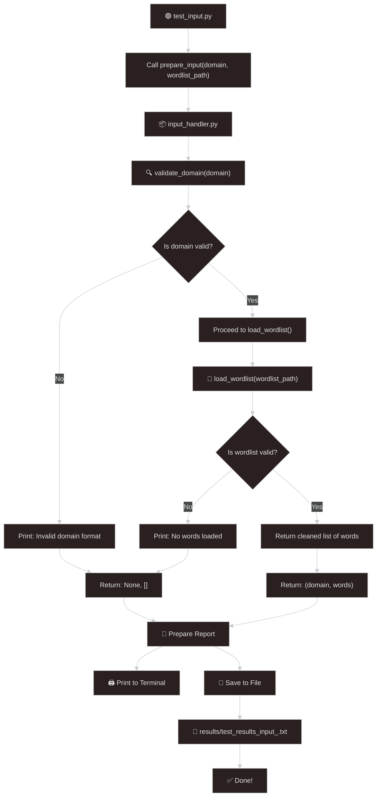

# (Day-2) Creating a test.py for input\_handler.py

## 🧪 Module Test: `test_input.py`

### 📦 Goal

This script helps test if the `input_handler.py` module is working correctly. Before building your full DNS enumeration tool, you want to make sure:

* ✅ Your domain is being validated properly
* ✅ Your wordlist file is loading correctly
* ✅ You’re getting cleaned output that later modules can use

Think of this like running diagnostics before turning on the engine.

***

### 📁 File Location Guide

```markdown

dns_enum_framework/
├── modules/
│   └── input_handler.py     ← Your input handler lives here
├── data/
│   └── wordlists/
│       └── sample.txt       ← Your subdomain list lives here
├── test_input.py            ← Your test script lives here

```

<mark style="color:$success;">So when your script says</mark> <mark style="color:$success;"></mark><mark style="color:$success;">`from modules.input_handler import prepare_input`</mark><mark style="color:$success;">, it's just looking at the</mark> <mark style="color:$success;"></mark><mark style="color:$success;">`modules`</mark> <mark style="color:$success;"></mark><mark style="color:$success;">folder and finding your function there.</mark>

***

### 📖 Sample Wordlist: `sample.txt`

This file contains common subdomain names that your scanner will brute-force.

```
www
admin
secure
api
login
ftp
mail
dev
test
monitor
vpn
```

Each one will be paired with your target domain like:\
`www.example.com`, `api.example.com`, etc.

***

## 📄 Code: `test_input.py`

```python
import os
from datetime import datetime
from modules.input_handler import prepare_input

# Step 1 — Ask user for input
domain_to_test = input("Enter the domain to scan: ").strip()
wordlist_path = input("Enter the path to the wordlist file: ").strip()

# Step 2 — Process the domain and wordlist
domain, subdomains = prepare_input(domain_to_test, wordlist_path)

# Step 3 — Setup output directory and results file
timestamp = datetime.now().strftime("%Y-%m-%d")
filename = f"test_results_input_{timestamp}.txt"
output_dir = "results"
os.makedirs(output_dir, exist_ok=True)
output_path = os.path.join(output_dir, filename)

# Step 4 — Build the output content
report_lines = [
    f"Domain: {domain}",
    f"Subdomains Loaded: {len(subdomains)}",
    f"Preview: {', '.join(subdomains[:5])}"
]

# Step 5 — Print to terminal
for line in report_lines:
    print(line)

# Step 6 — Write to output file
with open(output_path, "w") as f:
    for line in report_lines:
        f.write(line + "\n")

# Step 7 — Confirm success
print(f"\nResults saved to: {output_path}")

```

***

### <mark style="color:$danger;">🧠</mark> <mark style="color:$danger;"></mark><mark style="color:$danger;">`test_input.py`</mark> <mark style="color:$danger;"></mark><mark style="color:$danger;">— What's Happening : Step-by-Step Breakdown</mark>

#### 🔹 **Step 1 — Ask user for input**

```python
domain_to_test = input("Enter the domain to scan: ").strip()
wordlist_path = input("Enter the path to the wordlist file: ").strip()
```

**What's happening:**

* You're asking the user to manually type:
  * The **target domain** (like `example.com`)
  * The **path to a wordlist file** (like `wordlists/common.txt`)
* `.strip()` is used to remove any accidental spaces from the input.

***

#### 🔹 **Step 2 — Process the domain and wordlist**

```python
domain, subdomains = prepare_input(domain_to_test, wordlist_path)
```

**What's happening:**

* This line calls the `prepare_input()` function from `input_handler.py`.
* Internally:
  * The domain is validated using regex (e.g., no `http://` or invalid formats).
  * The wordlist file is loaded, cleaned, and returned as a list of subdomain prefixes.
* The result:
  * `domain`: the validated domain string.
  * `subdomains`: a list like `['www', 'admin', 'dev']`.

***

#### 🔹 **Step 3 — Setup output directory and results file**

```python
timestamp = datetime.now().strftime("%Y-%m-%d")
filename = f"test_results_input_{timestamp}.txt"
output_dir = "results"
os.makedirs(output_dir, exist_ok=True)
output_path = os.path.join(output_dir, filename)
```

**What's happening:**

* A **timestamped filename** is generated, e.g., `test_results_input_2025-07-23.txt`.
* A `results/` folder is ensured to exist (it will be created if missing).
* Full file path is created by combining folder and filename.

***

#### 🔹 **Step 4 — Build the output content**

```python
report_lines = [
    f"Domain: {domain}",
    f"Subdomains Loaded: {len(subdomains)}",
    f"Preview: {', '.join(subdomains[:5])}"
]
```

**What's happening:**

* You format key results into human-readable strings.
* `subdomains[:5]` shows only the first 5 items for quick preview.

***

#### 🔹 **Step 5 — Print to terminal**

```python
for line in report_lines:
    print(line)
```

**What's happening:**

* Each line from the `report_lines` list is printed to the terminal.
* This gives you immediate visual feedback during execution.

***

#### 🔹 **Step 6 — Write to output file**

```python
with open(output_path, "w") as f:
    for line in report_lines:
        f.write(line + "\n")
```

**What's happening:**

* A results file is created in the `results/` folder.
* Each report line is written to the file (with a newline).

***

#### 🔹 **Step 7 — Confirm success**

```python
print(f"\nResults saved to: {output_path}")
```

**What's happening:**

* A confirmation message tells you where the results were saved.
* You can now open that `.txt` file to review or use it later.

***

#### Summary: What this script does overall

* Takes input from the user (domain + wordlist path)
* Validates and prepares the data
* Generates a clean report
* Saves the output with a timestamp for tracking
* Ensures everything is reproducible and neatly logged

***

### **Flowchart**

<figure><figcaption></figcaption></figure>

### **Mermaid Flowchart Code**



***

Here’s a **well-structured, beginner-friendly process** on how to run your `test_input.py` script, which internally uses `input_handler.py` to validate domains and load wordlists.

***

## How to Run `test_input.py` with `input_handler.py`

This guide assumes:

* You're using a Linux/macOS/WSL terminal or Windows CMD/PowerShell
* You have the following file structure:

```
dns_enum_framework/
├── main.py
├── test_input.py              👈 The script you're running
├── modules/
│   └── input_handler.py       👈 Where `prepare_input()` lives
├── data/
│   └── wordlists/
│       └── sample.txt         👈 Your sample wordlist
└── results/                   👈 Output folder (created automatically)
```

***

### <mark style="color:$danger;">Prerequisites</mark>

Before you run the script, make sure you’ve:

*   **Python Installed**

    ```bash
    python --version
    ```

    You should see something like `Python 3.x.x`
*   **Correct Folder Structure**\
    Ensure `input_handler.py` exists under `modules/`, and a wordlist exists like:

    ```
    data/wordlists/sample.txt
    ```

***

### <mark style="color:$primary;">Step-by-Step Execution Process</mark>

#### 🧩 Step 1: Open Your Terminal

Navigate to the root of your project folder:

```bash
cd path/to/dns_enum_framework
```

***

#### 🔍 Step 2: Run the Script

Use the following command:

```bash
python test_input.py
```

***

#### ✍️ Step 3: Provide Inputs When Prompted

You'll be asked:

**✅ 1. Enter the domain to scan:**

```
example.com
```

**✅ 2. Enter the path to the wordlist file:**

```
data/wordlists/common.txt
```

✅ **Tip**: You can use `Tab` to auto-complete folder/file names.

***

#### 📋 Step 4: What Happens Next

Once you enter both inputs:

* The script validates the domain
* Loads subdomains from the wordlist
* Displays a preview (first 5 subdomains)
* Saves the summary to a `results/` folder with a dated filename

***

#### 📁 Step 5: Check Your Output File

A file like this will be created:

```
results/test_results_input_2025-07-23.txt
```

Open it in any text editor to view the result summary.

***

### 🧠 Example Run (Full Demo)

```bash
$ python test_input.py
Enter the domain to scan: example.com
Enter the path to the wordlist file: data/wordlists/common.txt
```

```
Domain: example.com
Subdomains Loaded: 150
Preview: www, admin, dev, mail, api

Results saved to: results/test_results_input_2025-07-23.txt
```

***

### 🛠️ Troubleshooting

| Problem                                          | Solution                                                          |
| ------------------------------------------------ | ----------------------------------------------------------------- |
| `ModuleNotFoundError: No module named 'modules'` | Make sure you're running the script from the root project folder. |
| `FileNotFoundError` for wordlist                 | Double-check the path you typed for the wordlist.                 |
| No subdomains loaded                             | Ensure the wordlist file isn’t empty and has one word per line.   |

***

### ✅ You’re Ready!

Now that your input handler is working:

* You can reuse it in your main DNS enumeration logic
* This validates your core input pipeline
