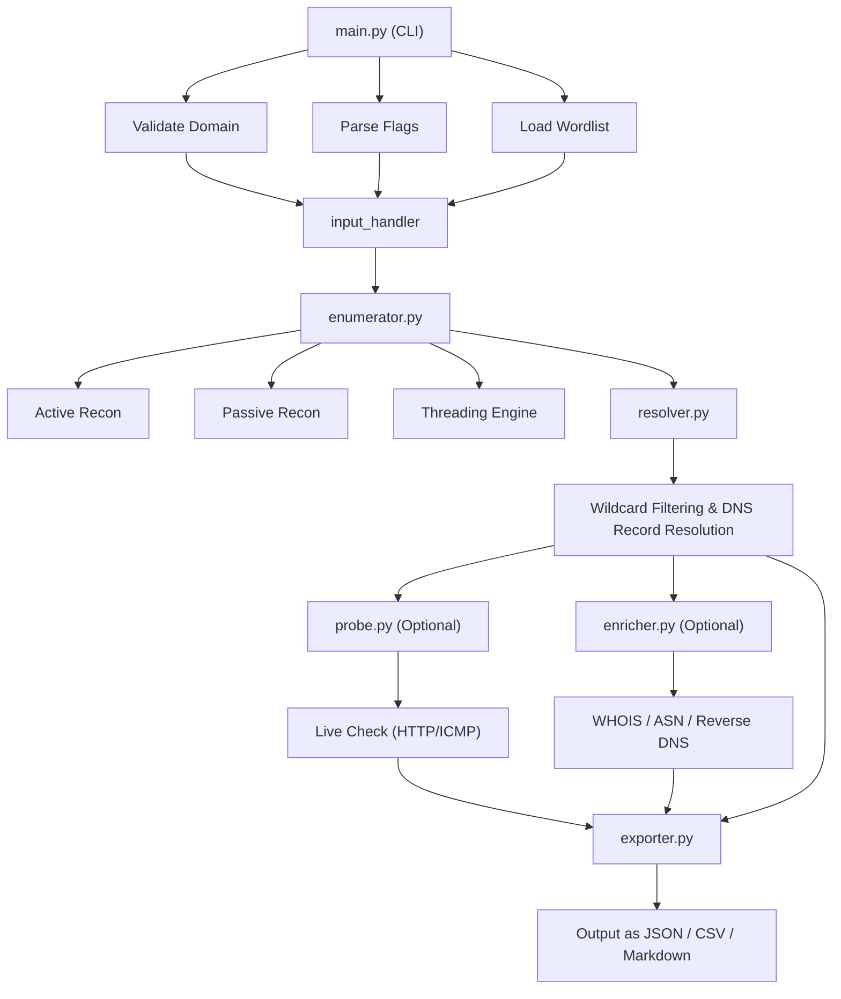

# (Day-1) - Writing Modules

### 📦 Module: `input_handler.py`

This module’s job is to:

* Load a wordlist of subdomains to brute-force later
* Validate that the domain input is correctly formatted
* Return both to be used by the core scanner

Let’s walk through each function:

***

