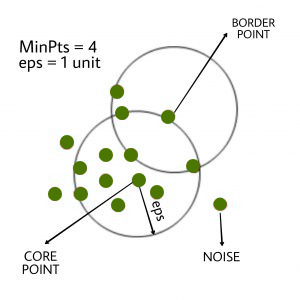

# DBSCAN (Density-Based Spatial Clustering of Applications with Noise)

#### **DBSCAN (Density-Based Spatial Clustering of Applications with Noise)**

DBSCAN is a popular unsupervised clustering algorithm designed to discover clusters based on the density of data points in a region. Unlike traditional clustering algorithms such as K-Means, DBSCAN does not require the number of clusters to be specified in advance. Instead, it identifies regions of high density as clusters and marks points in low-density regions as noise.

<div align="left"><figure><figcaption></figcaption></figure></div>

***

#### **Key Concepts**

DBSCAN operates based on three fundamental concepts:

1. **Core Points**:
   * A point is a **core point** if there are at least `min_samples` points (including itself) within a radius `eps` (epsilon). In other words, it has sufficient neighboring points within the `eps` distance to form a dense region.
2. **Border Points**:
   * A **border point** is a point that is within the `eps` distance from a core point but does not have enough points within its own `eps` distance to be considered a core point.
3. **Noise Points**:
   * A **noise point** (or outlier) is a point that is neither a core point nor a border point. These points do not belong to any cluster.

***

#### **How DBSCAN Works**

**Step 1: Choose Parameters**

* **`eps` (epsilon)**: Defines the neighborhood radius around each point. If another point is within this distance, it is considered a neighbor.
* **`min_samples`**: Defines the minimum number of points required in a neighborhood (including the point itself) for it to be considered a core point.

**Step 2: Classify Points**

* **Core Points**: A point is a core point if there are at least `min_samples` points (including itself) within the `eps` radius.
* **Border Points**: A point that is within `eps` of a core point but has fewer than `min_samples` in its neighborhood.
* **Noise Points**: Points that are neither core nor border points.

**Step 3: Expand Clusters**

* DBSCAN starts with an arbitrary unvisited point. If this point is a core point, a new cluster is formed, and all points within the `eps` radius are added to this cluster.
* Then, the algorithm recursively checks the neighbors of these points. If any of the neighbors are core points, their neighbors are also added to the cluster.
* This process continues until all reachable points (based on `eps` and `min_samples`) are added to the cluster.

**Step 4: Handle Border and Noise Points**

* Border points are added to clusters but do not expand clusters themselves.
* Noise points are left unclustered and are assigned a label of `-1`.

***

#### **Detailed Process Flow**

1. **Initialization**:
   * Mark all points as unvisited.
2. **Point Classification**:
   * For each unvisited point, check how many points lie within its `eps`-neighborhood.
   * If the point has more than or equal to `min_samples` neighbors, classify it as a core point.
   * If it has fewer than `min_samples` but is within `eps` of a core point, classify it as a border point.
   * If it has fewer than `min_samples` and is not within `eps` of any core point, classify it as noise.
3. **Cluster Formation**:
   * If a core point is found, a new cluster is started, and all directly reachable points within `eps` are added to the cluster.
   * Any border points within the cluster’s `eps` neighborhood are also included in the cluster.
   * The process continues iteratively, expanding the cluster by checking the neighbors of newly added points.
4. **Termination**:
   * The algorithm terminates once all points have been visited and assigned to clusters or marked as noise.

***

#### **Key Characteristics of DBSCAN**

* **Density-Based**:
  * DBSCAN forms clusters based on the density of points in a region, making it able to detect clusters of arbitrary shapes (not just circular or spherical clusters like in K-Means).
* **No Need for Predefined Cluster Count**:
  * Unlike algorithms like K-Means, DBSCAN does not require specifying the number of clusters beforehand.
* **Ability to Handle Noise**:
  * DBSCAN can handle noise and outliers by classifying points that do not belong to any cluster as noise (labeled as `-1`).
* **Cluster Shape**:
  * DBSCAN can detect clusters with arbitrary shapes. This is especially useful when data is not well separated into spherical clusters.
* **Sensitive to Parameters**:
  * The performance of DBSCAN depends heavily on the choice of `eps` and `min_samples`. If `eps` is too small, DBSCAN may classify many points as noise. If it's too large, it may merge distinct clusters. Similarly, `min_samples` should be chosen carefully to reflect the minimum density needed for a meaningful cluster.

***

#### **Advantages of DBSCAN**

* **Handles Arbitrary Shapes**: DBSCAN can detect clusters of any shape, making it suitable for more complex datasets.
* **Noise Handling**: It is capable of identifying and separating noise from meaningful clusters.
* **No Need for `k`**: DBSCAN does not require you to predefine the number of clusters, unlike K-Means or other clustering algorithms.
* **Works Well with Uneven Density**: DBSCAN can handle datasets with clusters of varying density, though tuning is important.

***

#### **Disadvantages of DBSCAN**

* **Sensitive to Parameters (`eps` and `min_samples`)**: Selecting appropriate values for `eps` and `min_samples` is crucial. The algorithm may fail to detect clusters if the parameters are poorly chosen.
* **Struggles with Varying Densities**: If a dataset contains clusters with significantly different densities, DBSCAN may not work well, as it uses a single `eps` for all points.
* **Computational Complexity**: In high-dimensional data, the algorithm may be computationally expensive due to the need to calculate distances between all pairs of points.

***

#### **DBSCAN in Action - Python Example**

```python
from sklearn.cluster import DBSCAN
import numpy as np
import matplotlib.pyplot as plt

# Example data
X = np.array([[1, 2], [1, 3], [2, 2], [8, 7], [8, 8], [25, 80]])

# Applying DBSCAN with eps=3 and min_samples=2
db = DBSCAN(eps=3, min_samples=2).fit(X)

# Getting labels: -1 for noise, otherwise the cluster number
labels = db.labels_

# Visualizing the clusters
plt.scatter(X[:, 0], X[:, 1], c=labels, cmap='viridis')
plt.title("DBSCAN Clustering")
plt.show()
```

In this example:

* Points `X` are clustered based on their proximity (`eps=3`).
* Points that do not fit into any cluster are labeled as `-1` (noise).

#### **Summary of DBSCAN**

* **Parameters**: `eps` (neighborhood radius) and `min_samples` (minimum points required for a dense region).
* **Works by**: Identifying core, border, and noise points to form clusters.
* **Advantages**: Detects clusters of arbitrary shapes, handles noise, no need for predefined cluster count.
* **Limitations**: Sensitive to the choice of `eps` and `min_samples`, struggles with clusters of varying densities.
